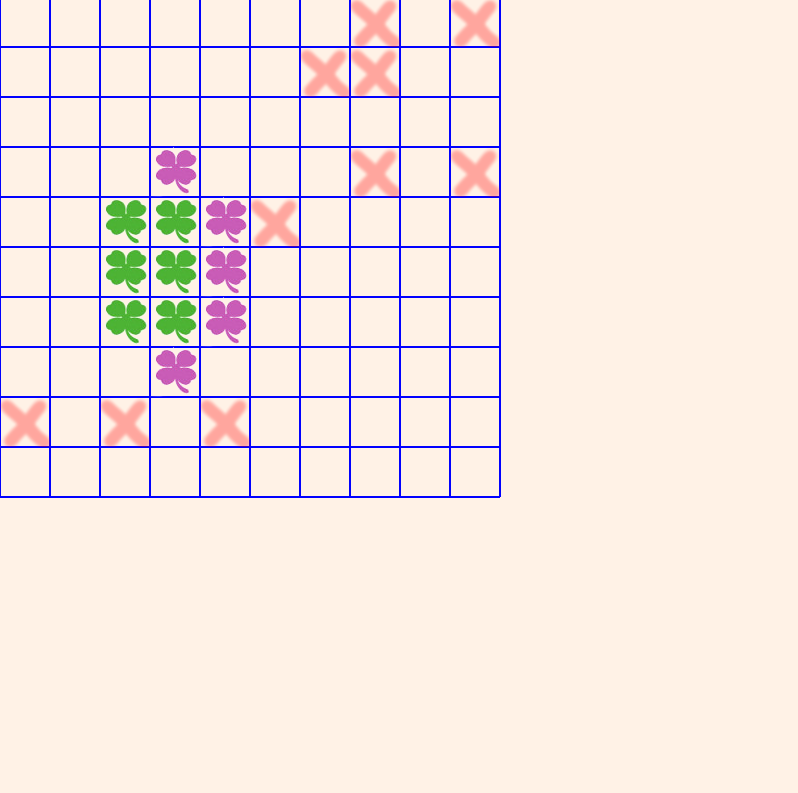

# connect-four
Haskell, free-gameで、4目並べを作りました。
このゲームで遊びたい方は、こちらで実行ファイルをダウンロードできます。https://github.com/v97ug/connect-four/releases

# がいよう

クローバーを４個並べたら勝ち。でも、縦と横だけだよ。ばってんが書いてあるところには置けないよ。

# ゲームの始め方

1. [こちら](https://github.com/v97ug/connect-four/releases)からconnect-four.zipをダウンロードして、展開します。
2. 展開したフォルダの中の、 connect-four-exeをダブルクリックすると、ゲームが始まります。

# スクリーンショット

# 使用した素材
[JKゴシックM](http://font.cutegirl.jp/jk-font-medium.html#more-460)